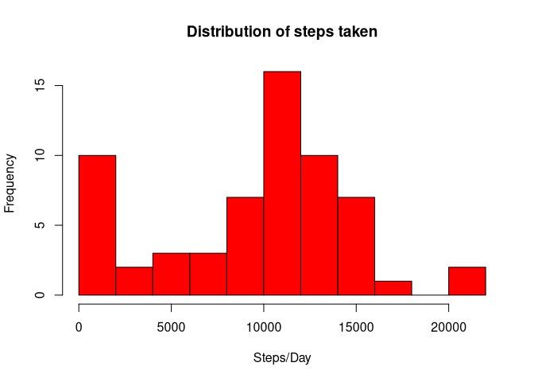
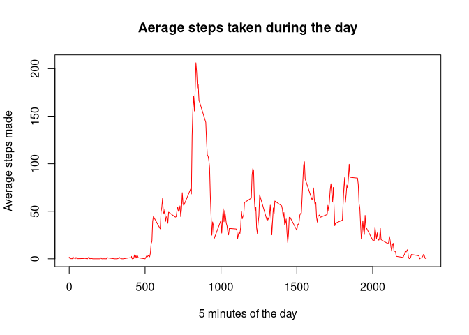
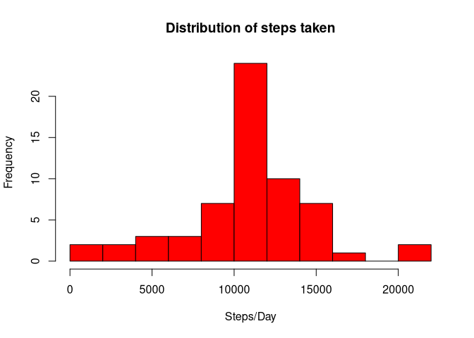
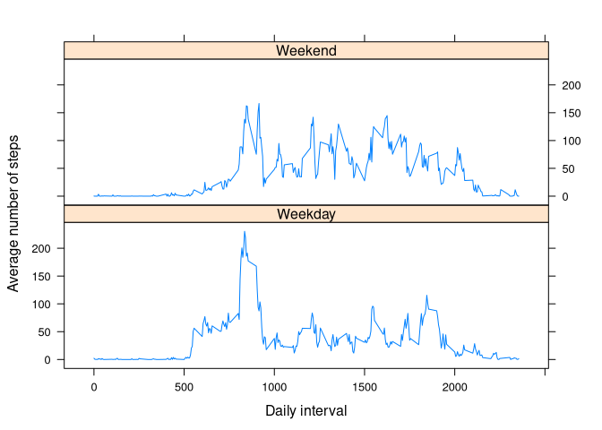

The following packages need to be installed for the script to run:

- `utils`: to unzip the file
- `xtable`: for nicer formatting


```r
## Making sure that all necessary packages exist
library(utils)
library(xtable)
library(lattice)
```

## Loading and preprocessing the data

The following code will extract the zip file and load data into the R:

```r
unzip("activity.zip")
df<-read.csv("activity.csv",header=T)
```

Date is loaded into the data frame as factor.
The following code does converts the date to `sys.date` and adds additional column `IsWeekend` to mark rows whose data was recorded on weekends.


```r
df$date<-as.character(df$date)
df$date<-as.Date(df$date,"%Y-%m-%d")
df$weekday<-as.integer(as.character(df$date,format="%w"))
df$isWeekend<-ifelse(df$weekday==0 | df$weekday==6,"Weekend","Weekday")
```

Below is the summary of the data:


```r
library(xtable)
xt<-xtable(summary(df))
print(xt,type="html")
```

<!-- html table generated in R 4.0.2 by xtable 1.8-4 package -->
<!-- Sun Aug 23 18:42:05 2020 -->
<table border=1>
<tr> <th>  </th> <th>     steps </th> <th>      date </th> <th>    interval </th> <th>    weekday </th> <th>  isWeekend </th>  </tr>
  <tr> <td align="right"> X </td> <td> Min.   :  0.00   </td> <td> Min.   :2012-10-01   </td> <td> Min.   :   0.0   </td> <td> Min.   :0   </td> <td> Length:17568       </td> </tr>
  <tr> <td align="right"> X.1 </td> <td> 1st Qu.:  0.00   </td> <td> 1st Qu.:2012-10-16   </td> <td> 1st Qu.: 588.8   </td> <td> 1st Qu.:1   </td> <td> Class :character   </td> </tr>
  <tr> <td align="right"> X.2 </td> <td> Median :  0.00   </td> <td> Median :2012-10-31   </td> <td> Median :1177.5   </td> <td> Median :3   </td> <td> Mode  :character   </td> </tr>
  <tr> <td align="right"> X.3 </td> <td> Mean   : 37.38   </td> <td> Mean   :2012-10-31   </td> <td> Mean   :1177.5   </td> <td> Mean   :3   </td> <td>  </td> </tr>
  <tr> <td align="right"> X.4 </td> <td> 3rd Qu.: 12.00   </td> <td> 3rd Qu.:2012-11-15   </td> <td> 3rd Qu.:1766.2   </td> <td> 3rd Qu.:5   </td> <td>  </td> </tr>
  <tr> <td align="right"> X.5 </td> <td> Max.   :806.00   </td> <td> Max.   :2012-11-30   </td> <td> Max.   :2355.0   </td> <td> Max.   :6   </td> <td>  </td> </tr>
  <tr> <td align="right"> X.6 </td> <td> NA's   :2304   </td> <td>  </td> <td>  </td> <td>  </td> <td>  </td> </tr>
   </table>

## What is mean total number of steps taken per day?

First lets calculate aggregate for each day:


```r
daggregate<-aggregate(df$steps,by=list(date=df$date),FUN=sum, na.rm=TRUE)
names(daggregate)<-c("date","steps")
hist(daggregate$steps, breaks=10, 
     xlab="Steps/Day",
     main="Distribution of steps taken", col="red")
```

<!-- -->

Where the mean and median values for the distribution are the following:


```r
mean(daggregate$steps, na.rm=T)
```

```
## [1] 9354.23
```

```r
median(daggregate$steps, na.rm=T)
```

```
## [1] 10395
```

## What is the average daily activity pattern?

Let's review the daily activity distribution.
For that we'll average 5-minute intervals for each day.


```r
maggregate<-aggregate(df$steps,by=list(interval=df$interval), FUN=mean
                      , na.rm=TRUE)
names(maggregate)<-c("interval","steps")
plot(maggregate$interval, maggregate$steps, type="l",
     col="red", xlab="5 minutes of the day", ylab="Average steps made", 
     main = "Aerage steps taken during the day")
```

<!-- -->

Looking at the diagram there is a definite peak.


```r
print(
    xtable(maggregate[maggregate$steps==max(maggregate$steps),])
    , type="html")
```

<!-- html table generated in R 4.0.2 by xtable 1.8-4 package -->
<!-- Sun Aug 23 18:42:05 2020 -->
<table border=1>
<tr> <th>  </th> <th> interval </th> <th> steps </th>  </tr>
  <tr> <td align="right"> 104 </td> <td align="right"> 835 </td> <td align="right"> 206.17 </td> </tr>
   </table>

## Inputing missing values

According to the summary dataset contains 2304 NA values. Check below:


```r
sum(is.na(df$steps))
```

```
## [1] 2304
```

Let's create another dataset, where we fill in NA values with the mean value of the particular time interval.
We have it calculated in the dataframe before.


```r
dffull<-merge(df, maggregate, by="interval")
dffull$steps<-ifelse(is.na(dffull$steps.x),dffull$steps.y,dffull$steps.x) 
```

The distribution of steps taken per date looks the following after adding the missing values:


```r
dfullaggregate<-aggregate(dffull$steps,by=list(date=dffull$date),FUN=sum)
names(dfullaggregate)<-c("date","steps")
hist(dfullaggregate$steps, breaks=10, 
     xlab="Steps/Day",
     main="Distribution of steps taken", col="red")
```

<!-- -->

The mean and median values after update are the following:


```r
mean(dfullaggregate$steps)
```

```
## [1] 10766.19
```

```r
median(dfullaggregate$steps)
```

```
## [1] 10766.19
```

As we can see from results, both histogram and value differ from the previous result, where NA values were removed from the set.
This shows on left part of the distribution.
Mean and median values become equal.

## Are there differences in activity patterns between weekdays and weekends?

It is interesting to see if there's any difference in behaviour during the 
weekdays and weekends. To do that, we'll create a dataset aggregated by interval and 
weekend factor.


```r
factoreddf<-aggregate(dffull$steps, 
                      by=list(interval=dffull$interval, 
                              isweekend=dffull$isWeekend)
                      , mean)
names(factoreddf)<-c("interval","isweekend","steps")
factoreddf$isweekend<-as.factor(factoreddf$isweekend)
xyplot(steps~interval|isweekend, data=factoreddf
       , layout=c(1,2)
       , type="l"
       , xlab = "Daily interval"
       , ylab = "Average number of steps")
```

<!-- -->

As it is visible from the diagram, there is an actual difference between activity during the weekend and regular weekdays.
